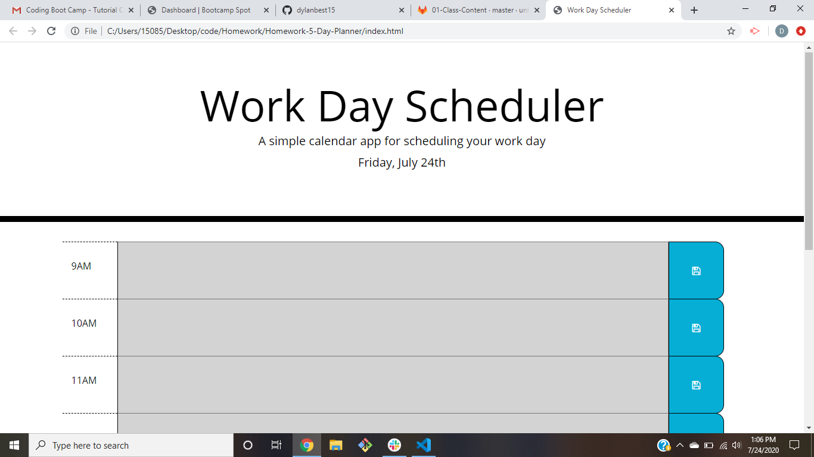

# Day-Planner
This website is a daily planner for work hours 9am - 5pm. The user can input anything within the time block for each hour and then click the save button to save their entries. This will be saved to their local storage so when they reload the page their notes will still be in the correct time block. In addition, this website utilizes momento.js in order to display the current day and date in the header, as well as color code the timeblocks: gray for past hours, red for the current hour, and green for future hours. This website should act as a simple tool for organizing tasks throughout the workday. 

https://dylanbest15.github.io/Day-Planner/